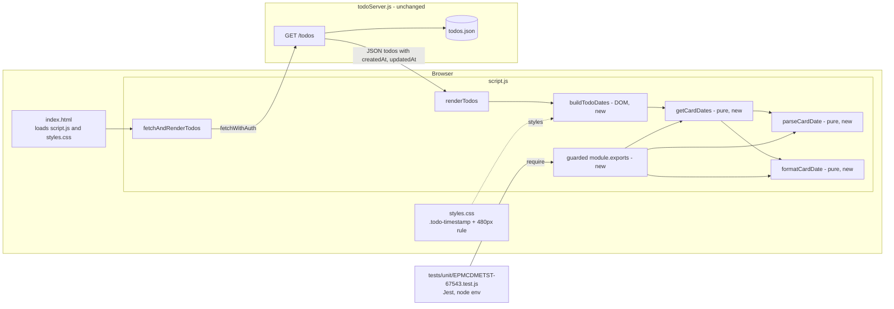
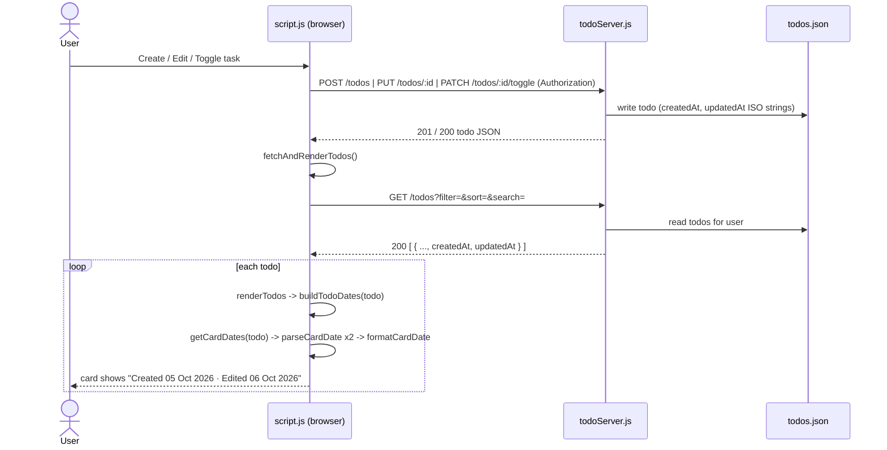

# EPMCDMETST-67543 – Architecture
Story: [EPMCDMETST-67543](https://jiraeu.epam.com/browse/EPMCDMETST-67543) · Branch: `feature/EPMCDMETST-67543-card-created-edited-dates` · Requirements: [requirements.md](requirements.md) · Date: 2026-10-04

## 1. Architecture Recommendation

Implement the feature entirely in the frontend, inside the existing card renderer. Add three small **pure** helpers to `public/script.js` (`parseCardDate`, `formatCardDate`, `getCardDates`) that turn a todo's `createdAt` / `updatedAt` values into display strings with no DOM access, and one small DOM builder (`buildTodoDates`) that `renderTodos` calls in place of the current `Created: … | Updated: …` line. All text is set with `textContent`. Styling reuses `.output .todo-timestamp` and gets one new `@media (max-width: 480px)` rule. The backend, API and data files stay unchanged, because GET /todos already returns both ISO timestamps and every create, edit and toggle already ends in `fetchAndRenderTodos()`, which re-renders the cards (AC-005). So the design needs no new dependency, route or data migration, and touches only the one line of rendering that the Story is about.

## 2. Component Diagram



## 3. Key Components & Responsibilities

| Component | File(s) | Responsibility | New/Changed |
|---|---|---|---|
| `EDITED_THRESHOLD_MS`, `CARD_MONTHS` | `public/script.js` | Constants: `1000` ms edit threshold; fixed English month list `Jan` … `Dec`. | New |
| `parseCardDate(value)` | `public/script.js` | Pure. Returns a valid `Date` or `null`. `null` when the value is absent, `null`, `''`, not a string/number, or `new Date(value)` is NaN. Never throws. | New |
| `formatCardDate(date)` | `public/script.js` | Pure. Formats a valid `Date` as `DD Mon YYYY` using local `getDate()` / `getMonth()` / `getFullYear()`; day zero-padded with `String(d).padStart(2, '0')`. Locale-independent. | New |
| `getCardDates(todo)` | `public/script.js` | Pure. Returns `{ created: string, edited: string \| null }`. `created` is `"Created 05 Oct 2026"` or `"Created: Not available"`. `edited` is `"Edited 06 Oct 2026"` only when both dates are valid and `updated - created > 1000`, otherwise `null`. Tolerates a `null`/non-object `todo`. | New |
| `buildTodoDates(todo)` | `public/script.js` | DOM. Builds the `div.todo-timestamp[data-testid="todo-dates"]` with a `span[data-testid="todo-created"]`, plus (only when `edited` is not null) a separator `span.todo-date-sep` (`" · "`, `aria-hidden="true"`) and `span[data-testid="todo-edited"]`. Uses `textContent` only. | New |
| `renderTodos(data)` | `public/script.js` | Replaces the current `timestamps` block (lines 70–73) with `const timestamps = buildTodoDates(element);`. Card assembly order is unchanged. | Changed (3 lines) |
| Guarded export | `public/script.js` (end of file) | `if (typeof module !== 'undefined' && module.exports) { module.exports = { parseCardDate, formatCardDate, getCardDates, EDITED_THRESHOLD_MS }; }` so Jest can `require` the pure helpers. Has no effect in the browser, where `module` is undefined. | New |
| Card metadata style | `public/styles.css` | `.output .todo-timestamp`: keep `font-size: 0.85em` and `margin-top`; change colour from `#bbb` to `#6b7280` (same grey family, contrast fix, see R-3). New `@media (max-width: 480px)` rule: date spans become `display: block`, separator hidden, `overflow-wrap: anywhere`, font size stays `0.85em` (≥ 0.8em). | Changed |
| Page markup | `index.html` | No change needed. | Unchanged |
| Backend | `todoServer.js` | No change. Already sets `createdAt` / `updatedAt` on POST, PUT and PATCH toggle. | Unchanged |
| Unit tests | `tests/unit/EPMCDMETST-67543.test.js` | Jest tests of the pure helpers (formatting, threshold, fallbacks). Before `require`, stub the globals `script.js` uses at load time: `window.location.origin`, `localStorage.getItem`, `document.addEventListener`. | New (Step 5) |
| API / E2E / Gherkin tests | `tests/api/`, `tests/e2e/`, `tests/features/` | Card display, Edited label after edit/toggle, regression of existing features. Use the `data-testid` hooks. | New (Step 7) |

## 4. Technology Choices

| Concern | Choice | Reason | Alternatives rejected |
|---|---|---|---|
| Date formatting | Built-in `Date` + local getters + fixed month array | Deterministic `DD Mon YYYY` in local time zone, independent of browser locale (FR-002); no dependency (NFR-002). | `toLocaleDateString('en-GB', { day: '2-digit', month: 'short', year: 'numeric' })`: output varies by engine/ICU (e.g. `Sept` vs `Sep`, missing ICU data in some Node builds), so unit tests become environment-dependent. date-fns / dayjs / moment: new dependency, forbidden by the Story. |
| Validity check | Type check (`string` or `number`, non-empty) then `isNaN(date.getTime())` | Matches FR-007 exactly; excludes `true`/`[]`/objects that `new Date()` would otherwise coerce into a valid date. | `new Date(value)` alone: coerces `true`, `[]` and similar values into valid dates, which FR-007 treats as invalid. |
| "Edited" rule | Millisecond comparison `updated.getTime() - created.getTime() > 1000` | Absorbs the ~1 ms gap from the two `new Date()` calls in POST /todos (Clarification 2) without a backend change. | Calendar-day comparison: hides same-day edits (rejected in Clarification 2). Fixing POST /todos: backend change, out of scope. |
| Rendering | `document.createElement` + `textContent` | XSS-safe (NFR-001); consistent with the rest of `renderTodos`. | Template string into `innerHTML`: unsafe and inconsistent. |
| Test hooks | `data-testid` on container, Created and Edited elements | Stable selectors for Playwright, independent of CSS classes (FR-011). | Selecting by class or text: brittle. |
| Unit-test loading | Guarded `module.exports` in `public/script.js` + global stubs in the test | `script.js` is a classic browser script with no module system; the guard is the smallest change that lets Jest `require` it, and costs nothing in the browser. Jest's default `node` environment is enough because the helpers are pure. | `jest-environment-jsdom`: not bundled with Jest 29, a new dev dependency. Moving helpers to a new ES module file: requires a second script tag or `type="module"` loading in `index.html` plus a shared global or import between files, which is more change than this Story needs. Reading the file with `vm`: works but is opaque and fragile. |
| Mobile layout | One CSS media query at 480px | Matches AC-006 breakpoint; pure CSS, no JS. | JS-based resize handling: unnecessary. |

## 5. Data Flow



No page reload happens anywhere in this flow (AC-005, FR-013). Formatting is constant work per card and adds no requests (NFR-005).

## 6. Low Level Design

### 6.1 Backend

No change (NFR-006). For reference, the existing behaviour the frontend relies on:

| Route | `createdAt` | `updatedAt` |
|---|---|---|
| POST /todos | `new Date().toISOString()` | second `new Date().toISOString()` call (0–few ms later) |
| PUT /todos/:id | kept | set to now |
| PATCH /todos/:id/toggle | kept | set to now (counts as Edited, KL-2) |
| GET /todos | returned as stored | returned as stored |

### 6.2 Data Model

Unchanged. Todo record (before = after):

| Field | Type | Notes |
|---|---|---|
| `createdAt` | ISO 8601 string | May be missing/invalid in legacy or hand-edited records; frontend shows `Created: Not available`. |
| `updatedAt` | ISO 8601 string | May be missing/invalid; frontend hides Edited. |

No defaults or migration are needed because missing values are handled at render time.

### 6.3 Frontend

Pseudocode for the pure helpers (the implementation follows this contract; Step 5 writes the code):

```js
const EDITED_THRESHOLD_MS = 1000;
const CARD_MONTHS = ['Jan','Feb','Mar','Apr','May','Jun','Jul','Aug','Sep','Oct','Nov','Dec'];

function parseCardDate(value) {
  if (typeof value !== 'string' && typeof value !== 'number') return null;
  if (typeof value === 'string' && value.trim() === '') return null;
  const d = new Date(value);
  return isNaN(d.getTime()) ? null : d;
}

function formatCardDate(date) {               // date: valid Date
  return String(date.getDate()).padStart(2, '0') + ' ' +
         CARD_MONTHS[date.getMonth()] + ' ' + date.getFullYear();
}

function getCardDates(todo) {
  const t = todo && typeof todo === 'object' ? todo : {};
  const created = parseCardDate(t.createdAt);
  const updated = parseCardDate(t.updatedAt);
  return {
    created: created ? 'Created ' + formatCardDate(created) : 'Created: Not available',
    edited: created && updated && updated.getTime() - created.getTime() > EDITED_THRESHOLD_MS
      ? 'Edited ' + formatCardDate(updated) : null,
  };
}
```

DOM produced by `buildTodoDates(todo)`:

```text
div.todo-timestamp            data-testid="todo-dates"
  span.todo-date              data-testid="todo-created"   "Created 05 Oct 2026"
  span.todo-date-sep          aria-hidden="true"           " · "      (only if edited)
  span.todo-date              data-testid="todo-edited"    "Edited 06 Oct 2026" (only if edited)
```

| Item | Value |
|---|---|
| New functions | `parseCardDate`, `formatCardDate`, `getCardDates` (pure), `buildTodoDates` (DOM) |
| Changed functions | `renderTodos` (timestamp block only) |
| State | None added |
| DOM ids | None added (cards keep existing `#title` / `#desc`) |
| CSS classes | `.todo-timestamp` (existing), `.todo-date`, `.todo-date-sep` (new) |
| data-testids | `todo-dates`, `todo-created`, `todo-edited` |
| Exports (Node only) | `parseCardDate`, `formatCardDate`, `getCardDates`, `EDITED_THRESHOLD_MS` |

CSS sketch:

```css
.output .todo-timestamp { font-size: 0.85em; color: #6b7280; margin-top: 0.2em; }
@media (max-width: 480px) {
  .output .todo-timestamp .todo-date { display: block; overflow-wrap: anywhere; }
  .output .todo-timestamp .todo-date-sep { display: none; }
}
```

The new 480px rule is placed after the existing 700px rule so it wins at narrow widths; the 400px rule only affects the modal and does not conflict.

## 7. API Contract

No API change. GET /todos (auth: `Authorization` session token) keeps its response shape; the frontend reads the existing `createdAt` and `updatedAt` fields of each todo. Error handling of the existing routes (400/401/404/500) is unchanged.

## 8. Wireframes

Desktop / tablet (> 480px), never edited:

```text
+------------------------------------------+
| [Active]                                 |
|  Buy milk                                |
|  2 litres, semi-skimmed                  |
|  Created 05 Oct 2026                     |
|  [Edit] [Delete] [Mark Complete]         |
+------------------------------------------+
```

Edited:

```text
+------------------------------------------+
| [Completed]                              |
|  Buy milk                                |
|  2 litres, semi-skimmed                  |
|  Created 05 Oct 2026 · Edited 06 Oct 2026|
|  [Edit] [Delete] [Mark Active]           |
+------------------------------------------+
```

Mobile (≤ 480px), edited:

```text
+------------------------------+
| [Active]                     |
|  Buy milk                    |
|  2 litres, semi-skimmed      |
|  Created 05 Oct 2026         |
|  Edited 06 Oct 2026          |
|  [Edit] [Delete] [Mark ...]  |
+------------------------------+
```

Missing / invalid creation date (Edited never shown):

```text
+------------------------------------------+
| [Active]                                 |
|  Legacy task                             |
|  Created: Not available                  |
|  [Edit] [Delete] [Mark Complete]         |
+------------------------------------------+
```

Empty list: unchanged existing state, `No todos found.`

## 9. Error Handling

| Case | Behaviour |
|---|---|
| `createdAt` missing, `null`, `''`, wrong type, unparsable | `Created: Not available`; no Edited element. |
| `updatedAt` missing or invalid | Created shown normally; no Edited element. |
| `updatedAt` ≤ `createdAt` + 1000 ms (incl. `updatedAt` before `createdAt`) | No Edited element. |
| `todo` itself `null` / not an object | `getCardDates` treats it as `{}` → `Created: Not available`; never throws. |
| One bad record in the list | Only that card shows the fallback; the others render normally (no exception escapes `renderTodos`). |
| Output text | Never contains `Invalid Date`, `NaN` or `undefined` (guaranteed because formatting runs only on validated dates). |
| GET /todos failure / 401 | Existing handling unchanged (`alert`, or re-auth on 401). |

## 10. Risks & Mitigations

| ID | Risk | Mitigation |
|---|---|---|
| R-1 | `public/script.js` reads `window`, `localStorage` and `document` at load time, so a plain `require` in Jest throws. | Tests stub these three globals before `require`; helpers are pure so no DOM is needed. Documented in Section 3 for Step 5. |
| R-2 | Unit tests depend on the machine time zone (local-time formatting). | Build test inputs with the local-time constructor `new Date(2026, 9, 5, 12, 0)` (midday, avoids date shifts), or set `process.env.TZ` in the test file before creating dates. |
| R-3 | Current `.todo-timestamp` colour `#bbb` on the near-white card has a contrast ratio of about 1.9:1, below WCAG AA (4.5:1) — conflicts with NFR-004. | Change to `#6b7280` (about 4.8:1 on white), same grey family. Visual change is limited to this metadata line. |
| R-4 | The guarded `module.exports` adds Node-specific code to a browser file. | `typeof module !== 'undefined'` check makes it a no-op in the browser; no `ReferenceError`. |
| R-5 | Toggle Complete/Active marks a task as Edited (KL-2), which users may find surprising. | Accepted in Clarification 3; recorded as Known Limitation. |
| R-6 | Existing E2E specs or tests may assert the old `Created: … \| Updated: …` text. | Requirements assumption A-4: no existing test references `.todo-timestamp`; Step 7 re-runs the full suite to confirm. |
| R-7 | Sort by `updatedAt` / `createdAt` (server side) is unaffected, but users may now notice ordering vs displayed dates more. | No change; sorting by date is out of scope. |

## 11. Traceability (FR/NFR → section)

| Requirement | AC | Design section(s) |
|---|---|---|
| FR-001 Created label | AC-001 | 3 (`getCardDates`, `buildTodoDates`), 6.3, 8 |
| FR-002 `DD Mon YYYY`, local time, locale-independent | AC-002 | 3 (`formatCardDate`), 4 (Date formatting), 6.3 |
| FR-003 Edited label format | AC-003 | 3 (`getCardDates`), 6.3, 8 |
| FR-004 Edited only if > 1000 ms later | AC-003 | 4 ("Edited" rule), 6.3, 6.1 |
| FR-005 Edited hidden otherwise | AC-003, AC-004 | 6.3, 9 |
| FR-006 `Created: Not available` | AC-004 | 6.3, 8, 9 |
| FR-007 Invalid-value definition, no throw | AC-004 | 3 (`parseCardDate`), 4 (Validity check), 9 |
| FR-008 One line, " · ", existing container | AC-006 | 3 (`buildTodoDates`, CSS), 6.3, 8 |
| FR-009 ≤ 480px wrap, ≥ 0.8em | AC-006 | 3 (CSS), 6.3 CSS sketch, 8 (mobile) |
| FR-010 Old Created/Updated line removed | Clar. 1 | 3 (`renderTodos` changed) |
| FR-011 data-testids | AC-008 | 3, 4 (Test hooks), 6.3 |
| FR-012 Pure function callable from tests | AC-008 | 3 (pure helpers, guarded export), 4 (Unit-test loading), 10 R-1 |
| FR-013 No reload after create/edit | AC-005 | 5 (Data Flow) |
| FR-014 Automated tests | AC-008 | 3 (Unit tests, API/E2E tests), 10 R-1, R-2 |
| FR-015 Existing features unchanged | AC-007 | 1, 6.1, 7, 10 R-6 |
| NFR-001 textContent | – | 3 (`buildTodoDates`), 4 (Rendering) |
| NFR-002 No dependencies, legacy data | – | 4, 6.2 |
| NFR-003 Consistent style | – | 3 (CSS), 6.3 |
| NFR-004 Legible ≤ 480px, contrast | – | 6.3 CSS sketch, 10 R-3 |
| NFR-005 Performance | – | 5 |
| NFR-006 No backend/API change | – | 6.1, 7 |

## Open Questions / Not Found

- Epic Link (`customfield_14500`): Not Found (carried over from requirements KL-1).
- Exact card background behind the metadata text is a semi-transparent white over a gradient; the contrast figure in R-3 assumes white. Final contrast is checked visually in Step 7.
- Known limitations KL-2 (toggle counts as edit) and KL-3 (changes under 1000 ms not shown) carry over unchanged.
