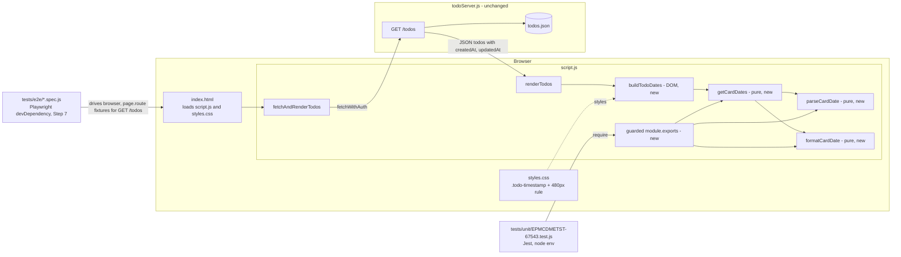
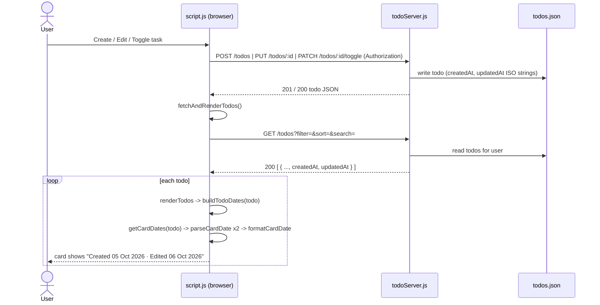

# EPMCDMETST-67543 – Architecture
Story: [EPMCDMETST-67543](https://jiraeu.epam.com/browse/EPMCDMETST-67543) · Branch: `feature/EPMCDMETST-67543-card-created-edited-dates` · Requirements: [requirements.md](requirements.md) · Design review: [design-review.md](design-review.md) (commit `0ad83a6`) · Date: 2026-10-04 (updated after design review 2026-10-04)

## 1. Architecture Recommendation

Implement the feature entirely in the frontend, inside the existing card renderer. Add three small **pure** helpers to `public/script.js` (`parseCardDate`, `formatCardDate`, `getCardDates`) that turn a todo's `createdAt` / `updatedAt` values into display strings with no DOM access, and one small DOM builder (`buildTodoDates`) that `renderTodos` calls in place of the current `Created: … | Updated: …` line. All text is set with `textContent`. Styling reuses `.output .todo-timestamp` and gets one new `@media (max-width: 480px)` rule. The backend, API and data files stay unchanged, because GET /todos already returns both ISO timestamps and every create, edit and toggle already ends in `fetchAndRenderTodos()`, which re-renders the cards (AC-005). So the design needs no new dependency, route or data migration, and touches only the one line of rendering that the Story is about. The only addition outside the product code is test tooling: `@playwright/test` as a **devDependency** with `playwright.config.js` and a `test:e2e` script, added in Step 7 for the E2E and AC-007 regression specs (D-1, approved out-of-story change OOS-2; NFR-002 is read as covering runtime/product dependencies only).

## 2. Component Diagram



## 3. Key Components & Responsibilities

| Component | File(s) | Responsibility | New/Changed |
|---|---|---|---|
| `EDITED_THRESHOLD_MS`, `CARD_MONTHS` | `public/script.js` | Constants: `1000` ms edit threshold; fixed English month list `Jan` … `Dec`. | New |
| `parseCardDate(value)` | `public/script.js` | Pure. Returns a valid `Date` or `null`. `null` when the value is absent, `null`, `''`, not a string/number, or `new Date(value)` is NaN. Never throws. | New |
| `formatCardDate(date)` | `public/script.js` | Pure. Formats a valid `Date` as `DD Mon YYYY` using local `getDate()` / `getMonth()` / `getFullYear()`; day zero-padded with `String(d).padStart(2, '0')`. Locale-independent. | New |
| `getCardDates(todo)` | `public/script.js` | Pure. Returns `{ created: string, edited: string \| null }`. `created` is `"Created 05 Oct 2026"` or `"Created: Not available"`. `edited` is `"Edited 06 Oct 2026"` only when both dates are valid and `updated - created > 1000`, otherwise `null`. Tolerates a `null`/non-object `todo`. | New |
| `buildTodoDates(todo)` | `public/script.js` | DOM. Builds the `div.todo-timestamp[data-testid="todo-dates"]` with a `span[data-testid="todo-created"]`, plus (only when `edited` is not null) a separator `span.todo-date-sep` (`" · "`, written as the escape `' · '` in code, D-8; **not** `aria-hidden`, so screen readers read the visible text, D-6) and `span[data-testid="todo-edited"]`. Uses `textContent` only. | New |
| `renderTodos(data)` | `public/script.js` | Replaces the current `timestamps` block (lines 70–73) with `const timestamps = buildTodoDates(element);`. Card assembly order is unchanged. Constants and helpers sit directly above `renderTodos`; pre-existing duplicates (second `fetchAndRenderTodos`, overlapping `window.onclick` / `keydown` handlers) are not refactored (D-11). | Changed (3 lines) |
| Guarded export | `public/script.js` (end of file) | `if (typeof module !== 'undefined' && module.exports) { module.exports = { parseCardDate, formatCardDate, getCardDates, EDITED_THRESHOLD_MS }; }` so Jest can `require` the pure helpers. Has no effect in the browser, where `module` is undefined. | New |
| Card metadata style | `public/styles.css` | `.output .todo-timestamp`: keep `font-size: 0.85em` and `margin-top`; change colour from `#bbb` to `#6b7280` (same grey family, contrast fix, see R-3). New `.output .todo-timestamp .todo-date { white-space: nowrap }` so above 480px the line can only break between the two items, never inside a label (D-5). New `@media (max-width: 480px)` rule: date spans become `display: block` with `white-space: normal` and `overflow-wrap: anywhere`, separator hidden, font size stays `0.85em` (≥ 0.8em). | Changed |
| Page markup | `index.html` | No change needed. | Unchanged |
| Backend | `todoServer.js` | No change. Already sets `createdAt` / `updatedAt` on POST, PUT and PATCH toggle. | Unchanged |
| Unit tests | `tests/unit/EPMCDMETST-67543.test.js` | Jest tests of the pure helpers (formatting, threshold, fallbacks). Before a single `require('../../public/script.js')`, define `global.window = { location: { origin: 'http://localhost:3000' } }`, `global.localStorage = { getItem: () => null }`, `global.document = { addEventListener: () => {} }` (D-9). Inputs are built with local-time constructors (e.g. `new Date(2026, 9, 5, 12, 0).toISOString()`) and include local-midnight boundary cases (00:30 and 23:30 local); `process.env.TZ` is not set (D-4). No jsdom; `buildTodoDates` and the DOM structure are covered by E2E. | New (Step 5) |
| E2E tests | `tests/e2e/` | Playwright/Chromium. Card display via the `data-testid` hooks. Fallback and threshold cases fulfil GET /todos with fixture data through `page.route` (missing, `null`, `''`, `'not-a-date'`, `true`, number, updated = created + 500 ms, + 1500 ms, updated before created). One real create → wait ≥ 1100 ms → edit flow proves AC-003/AC-005 end to end (D-3). Expected dates are computed in the browser with `page.evaluate(() => formatCardDate(new Date()))` (D-4). Explicit assertions for FR-009 (`scrollWidth ≤ clientWidth` of `todo-dates` at 375×667), FR-010 (no "Updated:" text) and FR-011 (`todo-edited` count 0 when not edited) (D-12). AC-007 regression specs for sign-up, login, create, edit, complete, filter, sort, search, delete (D-1). | New (Step 7) |
| E2E tooling | `package.json` (devDependencies, scripts), `playwright.config.js` | `@playwright/test` as a **devDependency** only, `playwright.config.js` per `tests/CLAUDE.md`, `test:e2e` script. Approved out-of-story change OOS-2 (D-1). No runtime dependency is added. | New (Step 7) |
| Gherkin scenarios | `tests/features/` | Scenarios for AC-001 … AC-008. | New (Step 7) |
| API tests | – | None for this Story: no endpoint is new or changed, so `todoServer.js` is not modified to export `app`. The GET /todos shape is exercised through E2E (D-2). | Not added |

## 4. Technology Choices

| Concern | Choice | Reason | Alternatives rejected |
|---|---|---|---|
| Date formatting | Built-in `Date` + local getters + fixed month array | Deterministic `DD Mon YYYY` in local time zone, independent of browser locale (FR-002); no dependency (NFR-002). | `toLocaleDateString('en-GB', { day: '2-digit', month: 'short', year: 'numeric' })`: output varies by engine/ICU (e.g. `Sept` vs `Sep`, missing ICU data in some Node builds), so unit tests become environment-dependent. date-fns / dayjs / moment: new dependency, forbidden by the Story. |
| Validity check | Type check (`string` or `number`, non-empty) then `isNaN(date.getTime())` | Matches FR-007 exactly; excludes `true`/`[]`/objects that `new Date()` would otherwise coerce into a valid date. | `new Date(value)` alone: coerces `true`, `[]` and similar values into valid dates, which FR-007 treats as invalid. |
| "Edited" rule | Millisecond comparison `updated.getTime() - created.getTime() > 1000` | Absorbs the ~1 ms gap from the two `new Date()` calls in POST /todos (Clarification 2) without a backend change. | Calendar-day comparison: hides same-day edits (rejected in Clarification 2). Fixing POST /todos: backend change, out of scope. |
| Rendering | `document.createElement` + `textContent` | XSS-safe (NFR-001); consistent with the rest of `renderTodos`. | Template string into `innerHTML`: unsafe and inconsistent. |
| Test hooks | `data-testid` on container, Created and Edited elements | Stable selectors for Playwright, independent of CSS classes (FR-011). | Selecting by class or text: brittle. |
| Unit-test loading | Guarded `module.exports` in `public/script.js` + global stubs in the test | `script.js` is a classic browser script with no module system; the guard is the smallest change that lets Jest `require` it, and costs nothing in the browser. Jest's default `node` environment is enough because the helpers are pure. | `jest-environment-jsdom`: not bundled with Jest 29, a new dev dependency. Moving helpers to a new ES module file: requires a second script tag or `type="module"` loading in `index.html` plus a shared global or import between files, which is more change than this Story needs. Reading the file with `vm`: works but is opaque and fragile. |
| Mobile layout | One CSS media query at 480px, plus `white-space: nowrap` on each date span above it (D-5) | Matches AC-006 breakpoint; pure CSS, no JS. `nowrap` keeps "Edited 06 Oct 2026" together on 320px-wide cards. | JS-based resize handling: unnecessary. |
| E2E test tooling | `@playwright/test` as a devDependency, Chromium, `playwright.config.js`, `test:e2e` script (D-1) | Required by AC-007/AC-008, `tests/CLAUDE.md` and the `verification-suite` skill; nothing in the repository provides it today. Dev-only, so no runtime/product dependency is added (NFR-002 interpreted as runtime dependencies, approved at Gate 3). | Manual browser checks only: no repeatable evidence for AC-007/AC-008. `jest-environment-jsdom` for DOM tests: another dev dependency, and it would not cover real layout (FR-009). |
| Fallback-case test data | `page.route` fixtures for GET /todos (D-3) | The server always writes valid ISO timestamps and tests must not edit `todos.json`, so missing/invalid values can only be produced by intercepting the response. | Hand-editing `todos.json`: forbidden (protected data). Adding a test-only endpoint: backend change, violates NFR-006. |

## 5. Data Flow



No page reload happens anywhere in this flow (AC-005, FR-013). Formatting is constant work per card and adds no requests (NFR-005).

## 6. Low Level Design

### 6.1 Backend

No change (NFR-006). For reference, the existing behaviour the frontend relies on:

| Route | `createdAt` | `updatedAt` |
|---|---|---|
| POST /todos | `new Date().toISOString()` | second `new Date().toISOString()` call (0–few ms later) |
| PUT /todos/:id | kept | set to now |
| PATCH /todos/:id/toggle | kept | set to now (counts as Edited, KL-2) |
| GET /todos | returned as stored | returned as stored |

### 6.2 Data Model

Unchanged. Todo record (before = after):

| Field | Type | Notes |
|---|---|---|
| `createdAt` | ISO 8601 string | May be missing/invalid in legacy or hand-edited records; frontend shows `Created: Not available`. |
| `updatedAt` | ISO 8601 string | May be missing/invalid; frontend hides Edited. |

No defaults or migration are needed because missing values are handled at render time.

### 6.3 Frontend

Pseudocode for the pure helpers (the implementation follows this contract; Step 5 writes the code):

```js
const EDITED_THRESHOLD_MS = 1000;
const CARD_MONTHS = ['Jan','Feb','Mar','Apr','May','Jun','Jul','Aug','Sep','Oct','Nov','Dec'];

function parseCardDate(value) {
  if (typeof value !== 'string' && typeof value !== 'number') return null;
  if (typeof value === 'string' && value.trim() === '') return null;
  const d = new Date(value);
  return isNaN(d.getTime()) ? null : d;
}

function formatCardDate(date) {               // date: valid Date
  return String(date.getDate()).padStart(2, '0') + ' ' +
         CARD_MONTHS[date.getMonth()] + ' ' + date.getFullYear();
}

function getCardDates(todo) {
  const t = todo && typeof todo === 'object' ? todo : {};
  const created = parseCardDate(t.createdAt);
  const updated = parseCardDate(t.updatedAt);
  return {
    created: created ? 'Created ' + formatCardDate(created) : 'Created: Not available',
    edited: created && updated && updated.getTime() - created.getTime() > EDITED_THRESHOLD_MS
      ? 'Edited ' + formatCardDate(updated) : null,
  };
}
```

DOM produced by `buildTodoDates(todo)`:

```text
div.todo-timestamp            data-testid="todo-dates"
  span.todo-date              data-testid="todo-created"   "Created 05 Oct 2026"
  span.todo-date-sep          (no aria-hidden, D-6)        " · "      (only if edited; '·' escape in code, D-8)
  span.todo-date              data-testid="todo-edited"    "Edited 06 Oct 2026" (only if edited)
```

| Item | Value |
|---|---|
| New functions | `parseCardDate`, `formatCardDate`, `getCardDates` (pure), `buildTodoDates` (DOM) |
| Changed functions | `renderTodos` (timestamp block only) |
| State | None added |
| DOM ids | None added (cards keep existing `#title` / `#desc`) |
| CSS classes | `.todo-timestamp` (existing), `.todo-date`, `.todo-date-sep` (new) |
| data-testids | `todo-dates`, `todo-created`, `todo-edited` |
| Exports (Node only) | `parseCardDate`, `formatCardDate`, `getCardDates`, `EDITED_THRESHOLD_MS` |

CSS sketch:

```css
.output .todo-timestamp { font-size: 0.85em; color: #6b7280; margin-top: 0.2em; }
.output .todo-timestamp .todo-date { white-space: nowrap; }            /* D-5 */
@media (max-width: 480px) {
  .output .todo-timestamp .todo-date { display: block; white-space: normal; overflow-wrap: anywhere; }
  .output .todo-timestamp .todo-date-sep { display: none; }
}
```

The new 480px rule is placed after the existing 700px rule so it wins at narrow widths; the 400px rule only affects the modal and does not conflict.

## 7. API Contract

No API change. GET /todos (auth: `Authorization` session token) keeps its response shape; the frontend reads the existing `createdAt` and `updatedAt` fields of each todo. Error handling of the existing routes (400/401/404/500) is unchanged.

## 8. Wireframes

Desktop / tablet (> 480px), never edited:

```text
+------------------------------------------+
| [Active]                                 |
|  Buy milk                                |
|  2 litres, semi-skimmed                  |
|  Created 05 Oct 2026                     |
|  [Edit] [Delete] [Mark Complete]         |
+------------------------------------------+
```

Edited:

```text
+------------------------------------------+
| [Completed]                              |
|  Buy milk                                |
|  2 litres, semi-skimmed                  |
|  Created 05 Oct 2026 · Edited 06 Oct 2026|
|  [Edit] [Delete] [Mark Active]           |
+------------------------------------------+
```

Mobile (≤ 480px), edited:

```text
+------------------------------+
| [Active]                     |
|  Buy milk                    |
|  2 litres, semi-skimmed      |
|  Created 05 Oct 2026         |
|  Edited 06 Oct 2026          |
|  [Edit] [Delete] [Mark ...]  |
+------------------------------+
```

Missing / invalid creation date (Edited never shown):

```text
+------------------------------------------+
| [Active]                                 |
|  Legacy task                             |
|  Created: Not available                  |
|  [Edit] [Delete] [Mark Complete]         |
+------------------------------------------+
```

Empty list: unchanged existing state, `No todos found.`

## 9. Error Handling

| Case | Behaviour |
|---|---|
| `createdAt` missing, `null`, `''`, wrong type, unparsable | `Created: Not available`; no Edited element. |
| `updatedAt` missing or invalid | Created shown normally; no Edited element. |
| `updatedAt` ≤ `createdAt` + 1000 ms (incl. `updatedAt` before `createdAt`) | No Edited element. |
| `todo` itself `null` / not an object | `getCardDates` treats it as `{}` → `Created: Not available`; never throws. |
| One bad record in the list | Only that card shows the fallback; the others render normally (no exception escapes `renderTodos`). |
| Output text | Never contains `Invalid Date`, `NaN` or `undefined` (guaranteed because formatting runs only on validated dates). |
| GET /todos failure / 401 | Existing handling unchanged (`alert`, or re-auth on 401). |

## 10. Risks & Mitigations

| ID | Risk | Mitigation |
|---|---|---|
| R-1 | `public/script.js` reads `window`, `localStorage` and `document` at load time, so a plain `require` in Jest throws. | Tests stub these three globals before `require`; helpers are pure so no DOM is needed. Documented in Section 3 for Step 5. |
| R-2 | Unit tests depend on the machine time zone (local-time formatting); E2E "today" assertions can flake around local midnight. | Unit tests build inputs with local-time constructors (`new Date(2026, 9, 5, 12, 0).toISOString()`) and add local-midnight boundary cases (00:30 and 23:30 local), which proves local, not UTC, formatting in any time zone. `process.env.TZ` is **not** set (not portable on Windows, does not prove local behaviour). E2E computes the expected date in the browser with `formatCardDate(new Date())` (D-4). |
| R-3 | Current `.todo-timestamp` colour `#bbb` on the near-white card has a contrast ratio of about 1.9:1, below WCAG AA (4.5:1) — conflicts with NFR-004. | Change to `#6b7280` (approved OOS-1). Calculated contrast: ≈ 4.7:1 on the worst-case effective card background `#fafbff` (85% white over `#e0e7ff`), ≈ 4.8:1 on white — both ≥ 4.5:1 (D-7). Final visual check in Step 7. |
| R-4 | The guarded `module.exports` adds Node-specific code to a browser file. | `typeof module !== 'undefined'` check makes it a no-op in the browser; no `ReferenceError`. |
| R-5 | Toggle Complete/Active marks a task as Edited (KL-2), which users may find surprising. | Accepted in Clarification 3; recorded as Known Limitation. |
| R-6 | Existing E2E specs or tests may assert the old `Created: … \| Updated: …` text; and no E2E regression suite exists for AC-007. | A-4 confirmed in design review: no existing test references `.todo-timestamp`. Step 7 adds AC-007 regression specs with the new Playwright tooling (D-1) and runs the full suite. Pre-existing duplicate code in `script.js` is not touched (D-11). |
| R-7 | Sort by `updatedAt` / `createdAt` (server side) is unaffected, but users may now notice ordering vs displayed dates more. | No change; sorting by date is out of scope. |
| R-8 | Installing `@playwright/test` and Chromium needs network access (KL-5 already shows a network failure). | Apply `mcp-retry-policy`; on failure report the exact error and stop for the human (D-1). |
| R-9 | Fallback cases cannot be produced through the real API, and an edit within 1 s of creation does not show "Edited", so naive E2E tests would be flaky or impossible. | `page.route` fixtures for fallback/threshold cases; one real flow waits ≥ 1100 ms before saving the edit (D-3). |
| R-10 | Unusual legacy values parse as valid but render oddly. | Accepted, no extra code; recorded as known limitations (D-10, see Open Questions). |

## 11. Traceability (FR/NFR → section)

| Requirement | AC | Design section(s) |
|---|---|---|
| FR-001 Created label | AC-001 | 3 (`getCardDates`, `buildTodoDates`), 6.3, 8 |
| FR-002 `DD Mon YYYY`, local time, locale-independent | AC-002 | 3 (`formatCardDate`), 4 (Date formatting), 6.3 |
| FR-003 Edited label format | AC-003 | 3 (`getCardDates`), 6.3, 8 |
| FR-004 Edited only if > 1000 ms later | AC-003 | 4 ("Edited" rule), 6.3, 6.1 |
| FR-005 Edited hidden otherwise | AC-003, AC-004 | 6.3, 9 |
| FR-006 `Created: Not available` | AC-004 | 6.3, 8, 9 |
| FR-007 Invalid-value definition, no throw | AC-004 | 3 (`parseCardDate`), 4 (Validity check), 9 |
| FR-008 One line, " · ", existing container | AC-006 | 3 (`buildTodoDates`, CSS), 6.3, 8 |
| FR-009 ≤ 480px wrap, ≥ 0.8em | AC-006 | 3 (CSS), 6.3 CSS sketch, 8 (mobile) |
| FR-010 Old Created/Updated line removed | Clar. 1 | 3 (`renderTodos` changed) |
| FR-011 data-testids | AC-008 | 3, 4 (Test hooks), 6.3 |
| FR-012 Pure function callable from tests | AC-008 | 3 (pure helpers, guarded export), 4 (Unit-test loading), 10 R-1 |
| FR-013 No reload after create/edit | AC-005 | 5 (Data Flow) |
| FR-014 Automated tests | AC-008 | 3 (Unit tests, E2E tests, E2E tooling), 4 (E2E test tooling, Fallback-case test data), 10 R-1, R-2, R-9 |
| FR-015 Existing features unchanged | AC-007 | 1, 3 (E2E regression specs), 6.1, 7, 10 R-6 |
| NFR-001 textContent | – | 3 (`buildTodoDates`), 4 (Rendering) |
| NFR-002 No dependencies, legacy data | – | 1, 4 (no runtime dependency; `@playwright/test` devDependency only, D-1), 6.2 |
| NFR-003 Consistent style | – | 3 (CSS), 6.3 |
| NFR-004 Legible ≤ 480px, contrast | – | 6.3 CSS sketch, 10 R-3 |
| NFR-005 Performance | – | 5 |
| NFR-006 No backend/API change | – | 6.1, 7 |

## Open Questions / Not Found

- Epic Link (`customfield_14500`): Not Found (carried over from requirements KL-1).
- Card background contrast: closed by design review (D-7); see R-3 for the calculated figures. Final visual check stays in Step 7.
- Known limitations KL-2 (toggle counts as edit) and KL-3 (changes under 1000 ms not shown) carry over unchanged.
- Known limitations added by design review (D-10), no extra code: a date-only string such as `'2026-10-05'` is parsed as UTC midnight and can show the previous day in negative UTC offsets; years outside 1000–9999 (e.g. `'0001-01-01'`) do not render with 4 digits; numeric timestamps such as `0` render as a date ("01 Jan 1970"); saving the Edit modal without changes still bumps `updatedAt` and shows "Edited" (same cause as KL-2). The server always writes full ISO UTC timestamps, so this affects only hand-edited or legacy data.

## Approved Out-of-Scope Changes

| ID | Change | Approval |
|---|---|---|
| OOS-1 | `.output .todo-timestamp` colour `#bbb` → `#6b7280` (contrast, NFR-004). | Explicitly approved by the user at Gate 2. |
| OOS-2 | `@playwright/test` as a devDependency, `playwright.config.js`, `test:e2e` script and AC-007 regression specs, added in Step 7 (D-1). NFR-002 interpreted as runtime dependencies only. | Explicitly approved by the user at Gate 3 ("approve" of D-1 … D-12 as written in design-review.md). |

## Changes after design review

2026-10-04 — applied the decisions agreed at Gate 3 from [design-review.md](design-review.md) (commit `0ad83a6`). All twelve decisions D-1 … D-12 were agreed as written. Component structure, helper contracts and data flow are unchanged.

| Decision | What changed | Where |
|---|---|---|
| D-1 | Added Playwright E2E tooling (`@playwright/test` devDependency, `playwright.config.js`, `test:e2e`) and AC-007 regression specs for Step 7; recorded as approved out-of-story change OOS-2; NFR-002 read as runtime dependencies only; network-install risk added. | Section 1, Section 2 (PW node), Section 3 (E2E tests, E2E tooling rows), Section 4 (E2E test tooling row), Section 10 R-6, R-8, Section 11 NFR-002, Approved Out-of-Scope Changes |
| D-2 | Removed `tests/api/` from the test components; no API test file for this Story, `todoServer.js` not modified. | Section 3 (API tests row) |
| D-3 | E2E uses `page.route` fixtures for fallback and threshold cases plus one real create → wait ≥ 1100 ms → edit flow. | Section 2, Section 3 (E2E tests row), Section 4 (Fallback-case test data row), Section 10 R-9 |
| D-4 | Unit tests use local-time constructors and local-midnight boundary cases; `process.env.TZ` option removed; E2E computes expected date with `formatCardDate` in the browser. | Section 3 (Unit tests, E2E tests rows), Section 10 R-2 |
| D-5 | `white-space: nowrap` on `.todo-date` above 480px; `white-space: normal` + `overflow-wrap: anywhere` at ≤ 480px. | Section 3 (Card metadata style row), Section 4 (Mobile layout row), Section 6.3 CSS sketch |
| D-6 | Separator span is no longer `aria-hidden`. | Section 3 (`buildTodoDates` row), Section 6.3 DOM sketch |
| D-7 | Recorded calculated contrast (≈ 4.7:1 worst case, ≈ 4.8:1 on white); open question closed. | Section 10 R-3, Open Questions |
| D-8 | Separator written as the `·` escape in code (noted only, implementation detail). | Section 3 (`buildTodoDates` row), Section 6.3 DOM sketch |
| D-9 | Unit-test setup: three exact global stubs, then one `require`; no jsdom (noted only). | Section 3 (Unit tests row) |
| D-10 | Added known limitations for date-only strings, years outside 1000–9999, numeric timestamps and unchanged Edit-modal save. | Open Questions, Section 10 R-10 |
| D-11 | No refactor of pre-existing duplicates; helpers directly above `renderTodos`, export last (noted only). | Section 3 (`renderTodos` row), Section 10 R-6 |
| D-12 | Explicit E2E assertions for FR-009, FR-010, FR-011 named (detail belongs in `impl-plan.md` / `verification.md`). | Section 3 (E2E tests row) |
