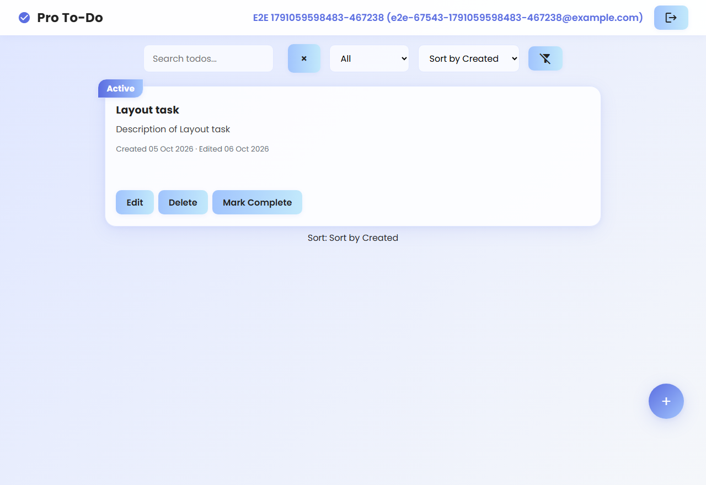
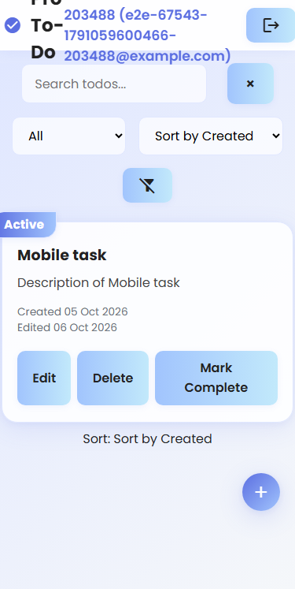

# EPMCDMETST-67543 – Verification
Story: [EPMCDMETST-67543](https://jiraeu.epam.com/browse/EPMCDMETST-67543) · Branch: `feature/EPMCDMETST-67543-card-created-edited-dates` · Requirements: [requirements.md](requirements.md) · Architecture: [architecture.md](architecture.md) · Plan: [impl-plan.md](impl-plan.md) · Code review: [code-review.md](code-review.md)

Branch: `feature/EPMCDMETST-67543-card-created-edited-dates` · Commit under test: `7911b41` (application code unchanged since `7eef3cb` / `b03a48d`) · Date: 2026-10-04 · Environment: Windows 11 Enterprise 10.0.26200, Node v22.12.0, npm 10.9.0, `@playwright/test` 1.63.0, Chromium 153.0.8010.12 (Playwright revision 1243, headless), host time zone Asia/Calcutta (UTC+05:30)

Scope: impl-plan Step 7 tasks T-8 … T-15. No application code (`public/`, `index.html`, `todoServer.js`) was changed in this step.

## 1. Summary

| Suite | Total | Passed | Failed | Skipped | Duration |
|---|---|---|---|---|---|
| Unit — `npm run test:unit` (`tests/unit/EPMCDMETST-67543.test.js`, Step 5) | 51 | 51 | 0 | 0 | 0.316 s |
| Hooks — `npm run test:hooks` (pipeline) | 46 | 46 | 0 | 0 | 5.896 s |
| Docs checker — `npm run test:docs` (pipeline) | 9 | 9 | 0 | 0 | 1.243 s |
| Integration (API) — `npm run test:api` | Not applicable | – | – | – | – |
| E2E — `npm run test:e2e` (`tests/e2e/EPMCDMETST-67543.spec.js`) | 28 | 28 | 0 | 0 | 1.3 min |
| **Total** | **134** | **134** | **0** | **0** | |

Notes:
- **Integration (API): not applicable.** The Story is frontend-only; no endpoint was added or changed and `todoServer.js` is untouched (NFR-006, design-review D-2, impl-plan Section 5). No `tests/api/EPMCDMETST-67543.test.js` and no `test:api` script were created, and `todoServer.js` was not changed to export `app`.
- E2E: 19 story tests + 9 AC-007 regression tests, 1 worker (the server writes JSON files with read-modify-write, so runs are serial), 0 retries, no flaky tests. During development, one run had a failure caused by a wrong expectation in the test (see Section 4, OBS-1). The test was corrected and the full suite was re-run twice; both runs were 28/28 green. The numbers above are from the final run.
- **Coverage (CR-03):** Jest line coverage for `public/script.js` is **Not Found**. The unit test loads the script with `vm.runInThisContext` (approved OOS-3, needed because of the pre-existing duplicate `fetchAndRenderTodos`), which skips Jest's instrumentation. Coverage evidence is the case list (impl-plan Section 4) plus the E2E tests in Section 2.
- No `test.only`, `test.skip` or `test.fixme` in committed test code (grep-checked).

### Setup changes (T-8, T-9). Approved out-of-story change OOS-2 (Gate 3, decision D-1)

| Change | File | Commit |
|---|---|---|
| `@playwright/test` `^1.63.0` added under **devDependencies** only (no runtime dependency) | `package.json`, `package-lock.json` | `b2ba48c` |
| Script `"test:e2e": "playwright test"` | `package.json` | `b2ba48c` |
| `playwright.config.js`: `testDir: 'tests/e2e'`, Chromium only, HTML reporter → `playwright-report/`, `webServer: { command: 'node todoServer.js', url: 'http://localhost:3000', reuseExistingServer: true }`, `workers: 1` | `playwright.config.js` | `b2ba48c` |

Network: `npm install -D @playwright/test` succeeded on the first attempt (no `ETIMEDOUT`, so `NODE_OPTIONS` was not needed). `npx playwright install chromium` finished without downloading anything because Chromium revision 1243 was already in the local Playwright cache. `npm audit` gives the same result before and after the install: 31 vulnerabilities (1 moderate, 30 high), all pre-existing (CR-07). Playwright adds none.

### Data safety

Before every E2E run, `todos.json`, `users.json` and `sessions.json` were copied to `*.bak`. A shell `trap` restored them after every run and deleted the backups, including after the run that failed. SHA-1 before and after the final run is identical: `todos.json` `f829bb73…`, `users.json` `95e6d34f…`, `sessions.json` `22d500f7…`. No `.bak` files are left, and no data file was committed.

## 2. Acceptance Criteria Traceability

Gherkin: [`tests/features/EPMCDMETST-67543.feature`](../../../tests/features/EPMCDMETST-67543.feature) (28 scenarios, tagged `@EPMCDMETST-67543` and `@AC-n`). E2E: [`tests/e2e/EPMCDMETST-67543.spec.js`](../../../tests/e2e/EPMCDMETST-67543.spec.js). Each scenario has exactly one test with the same title (28 = 28). "Fixture" means GET /todos is stubbed with `page.route` after a real sign-up and login (D-3). Expected dates are computed in the browser with the app's own `formatCardDate` (D-4). Unit = `tests/unit/EPMCDMETST-67543.test.js` (describe block). Integration = Not applicable (D-2) on every row.

| AC | Scenario (= E2E test title) | Unit | E2E | Result |
|---|---|---|---|---|
| AC-001 | New task shows Created with today's date | `getCardDates` › builds the Created label without a colon | real create; `todo-created` = `'Created ' + formatCardDate(new Date())`, no colon | PASS |
| AC-001, AC-003 | Welcome task of a new user shows Created and no Edited label | `getCardDates` +1 ms / +500 ms cases | real server-created welcome todo (two `new Date()` calls) → no `todo-edited` | PASS |
| AC-002 | Dates use the DD Mon YYYY format | `formatCardDate` (12 months, padding, 4-digit year) | fixture → `Created 09 Jan 2026`, `Edited 31 Dec 2026`; regex `^(Created\|Edited) \d{2} Mon \d{4}$`; no time of day | PASS |
| AC-002 | Dates are shown in the user's local time zone | `formatCardDate` 00:30 / 23:30 local | browser contexts `Pacific/Kiritimati` (UTC+14) → `06 Oct` / `07 Oct`; `America/Los_Angeles` → `04 Oct` / `05 Oct` | PASS |
| AC-003, AC-005 | Edited label appears after a task is edited | `getCardDates` +1001 ms, +1 day | real create → wait 1100 ms → edit → `Created <today> · Edited <today>` (exact `textContent`, separator `" · "`); no reload | PASS |
| AC-003 | Edited label is hidden when last-updated is within 1000 ms of creation | +1 / +500 / +1000 ms boundary | fixtures +0, +1, +500, +1000 ms → no `todo-edited`, no separator | PASS |
| AC-003 | Edited label is shown when last-updated is more than 1000 ms after creation | +1001 ms, +1 day, same-day edit | fixtures +1001 ms, +1500 ms, +1 day → `Edited DD Mon YYYY` | PASS |
| AC-003 | Edited label is hidden when last-updated is before creation | updatedAt before createdAt | fixture −1 day → Created only | PASS |
| AC-003 | Toggling a task to Completed counts as an edit | – | real create → wait 1100 ms → Mark Complete → `Edited <today>` (KL-2, documented behaviour) | PASS |
| AC-004 | Missing or invalid creation date shows the Not available fallback | `parseCardDate` / `getCardDates` invalid createdAt | fixtures createdAt missing, `null`, `''`, `'   '`, `'not-a-date'`, `true` → exactly `Created: Not available`, no `todo-edited` | PASS |
| AC-004 | Missing or invalid last-updated date shows no Edited label | invalid updatedAt cases | fixtures updatedAt missing, `null`, `''`, `'not-a-date'`, `true` → Created shown, no `todo-edited` | PASS |
| AC-004 | Numeric timestamps are formatted as dates | `parseCardDate` valid number | numeric ms fixture 2 days apart → Created and Edited formatted (D-10) | PASS |
| AC-004 | Invalid dates never break the list or show raw error text | output never contains Invalid Date / NaN / undefined; `todo` null / non-object | valid + date-less + HTML-string fixtures → all 3 cards rendered, no `pageerror`, no `Invalid Date` / `NaN` / `undefined`, no `` injected (NFR-001) | PASS |
| AC-005 | Created date appears immediately after creating a task without a page reload | – | real create; date present right after save; document marker survives (no reload) | PASS |
| AC-006 | Created and Edited are on one line with a middle-dot separator on desktop | – | 1280×800: same line (Δy < 2 px), separator visible and exactly `" · "`; screenshot | PASS |
| AC-006 | Dates stack and stay fully visible at mobile width 375px | – | 375×667: Edited below Created, separator hidden, spans `display: block` and visible, `scrollWidth ≤ clientWidth`, inside the card, font ratio ≥ 0.8 (FR-009 / D-12); screenshot | PASS |
| AC-006 | Dates switch to the stacked layout at the 480px breakpoint | – | 481 px inline, 480 px stacked | PASS |
| AC-006 | Date text keeps the card metadata style and readable contrast | – | class `todo-timestamp`; colour `rgb(107, 114, 128)`; contrast vs white 4.83:1 (≥ 4.5); font ratio 0.850 (T-14, D-7) | PASS |
| AC-007 | Regression: user can sign up | – | "Signup successful! Please login." and login form shown | PASS |
| AC-007 | Regression: user can log in | – | header `name (email)`, logout button and welcome card shown | PASS |
| AC-007 | Regression: user can create a task | – | card with title, description, `Active` badge | PASS |
| AC-007 | Regression: user can edit a task | – | new title and description shown, old title gone | PASS |
| AC-007 | Regression: user can mark a task complete | – | `Completed` badge, `completed` class, `Mark Active` button | PASS |
| AC-007 | Regression: user can filter tasks by status | – | Completed → only the done card; Active → done card hidden | PASS |
| AC-007 | Regression: user can sort tasks by title | – | order `Alpha task`, `Bravo task`, `Welcome to your To-Do List!` | PASS |
| AC-007 | Regression: user can search tasks | – | `groceries` → only `Groceries list` | PASS |
| AC-007 | Regression: user can delete a task | – | `confirm()` accepted, card removed, welcome card remains | PASS |
| AC-008 | Card date markup exposes test ids and no legacy Updated text | 51 unit tests (formatting, Edited rules, fallbacks) | one `todo-dates` with one `todo-created` per card; `todo-edited` and separator only on the edited card (3 vs 1 child spans) (FR-011); no `Updated:` text (FR-010) | PASS |

AC coverage: **8 / 8** ACs have at least one scenario and one passing test. All D-12 assertions are present: FR-009 (overflow and font ratio at 375 px), FR-010 (no `Updated:`) and FR-011 (`todo-edited` absent when not edited). CR-01 is closed: the DOM structure, test ids, separator text, ≤ 480 px layout and the refresh without reload are now covered by tests.

### Contrast and visual check (T-14, D-7)

| Check | Result |
|---|---|
| Computed `color` of `[data-testid="todo-dates"]` (`.todo-timestamp`) | `rgb(107, 114, 128)` (= `#6b7280`, OOS-1) — asserted |
| Contrast vs white (computed in the browser, WCAG formula) | 4.83:1 (≥ 4.5:1 AA). Plan figure for worst-case `#fafbff` card tint: ≈ 4.7:1 (calculated in impl-plan, not measured) |
| Font size | 0.850 × card font size (≥ 0.8em) at desktop and 375 px |
| Desktop 1280×800 |  — `Created 05 Oct 2026 · Edited 06 Oct 2026` on one line |
| Mobile 375×667 |  — Created and Edited on separate lines, no separator, no clipping |

Screenshots: [`screenshots/EPMCDMETST-67543-desktop-1280x800.png`](screenshots/EPMCDMETST-67543-desktop-1280x800.png), [`screenshots/EPMCDMETST-67543-mobile-375x667.png`](screenshots/EPMCDMETST-67543-mobile-375x667.png). The tests capture them with `animations: 'disabled'`. The first capture caught the card mid-way through its pre-existing `fadeIn` animation and looked washed out, so it was re-taken (test timing fix only).

## 3. Document Quality Check

Command: `npm run docs:check -- EPMCDMETST-67543` (`scripts/check-docs.mjs`). Exit code 1, 1 error, 0 warnings. The run was made before this file existed. The result for `verification.md` comes from a re-run after it was written, recorded in the last row.

| Document | Errors | Warnings | Not Found items |
|---|---|---|---|
| requirements.md | 0 | 0 | 4 (Labels; Epic Link `customfield_14500` ×2; KL-4 Labels) |
| architecture.md | 0 | 0 | 2 (section heading; Epic Link) |
| design-review.md | 0 | 0 | 3 (D-10 reference; section heading; Epic Link) |
| impl-plan.md | 0 | 0 | 6 (test-case heading; build script PR-2 ×2; Epic Link ×2; section heading) |
| implementation-notes.md | 0 | 0 | 3 (build script ×2; known-limitations carry-over) |
| code-review.md | 0 | 0 | 2 (checklist wording; CR-03 coverage) |
| README.md | **1** — `broken link: LICENSE` | 0 | 0 |
| verification.md (re-run after writing) | 0 | 0 | 5 (coverage CR-03 ×2; table heading; build script PR-2; Epic Link) |

The `README.md` error is **pre-existing** and outside this Story: `README.md` links to a `LICENSE` file that does not exist in the repository. The README was not fixed because that change is not approved (Global Rule 2). It is recorded as DEF-PRE-1. Every SDLC artifact of this Story has 0 errors, so the impl-plan done criterion for T-15 ("0 errors for this Story") is met for the Story's own documents. The overall command still exits with 1 because of the README.

## 4. Defects

| ID | Severity | Description | Found by |
|---|---|---|---|
| – | – | **No defect in the Story's code.** All 28 E2E and 51 unit tests pass against the unchanged application code. | – |
| DEF-PRE-1 | Low (pre-existing, out of scope) | `README.md` links to `LICENSE`, which does not exist → `docs:check` error. Not introduced by this branch. Not fixed (not approved). | `npm run docs:check` |
| OBS-1 | Info (spec-level limitation, not a defect) | Chromium's lenient `Date` parser accepts some arbitrary strings that contain digits. For example, `new Date('')` gives `01 Jan 2001`. That card shows `Created 01 Jan 2001` instead of `Created: Not available`. This follows FR-007, which defines "invalid" as `new Date(value)` yielding NaN, so it is not a code defect. It extends the D-10 known limitations (non-ISO input is not rejected). The HTML is still rendered as text and is not injected (NFR-001 holds). My first E2E expectation was wrong; it was corrected to use a digit-free probe string, with a comment in the spec. | E2E "Invalid dates never break the list or show raw error text" (first run) |
| OBS-2 | Info (pre-existing, out of scope) | At 375 px the header title "Pro To-Do" wraps onto three lines and is clipped at the top of the header (visible in the mobile screenshot). This is pre-existing header CSS, unrelated to the card dates, and the date line itself is not affected. | T-14 mobile screenshot |
| OBS-3 | Info (pre-existing) | Existing controls have no `data-testid` (only the new date elements do). The regression specs use the existing `id`s (`#auth-email`, `#edit-title`, `#filter-select` …) and role/text locators instead. Adding test ids would change application code and is out of scope. | Test authoring |

### Deviations from the plan

- T-13 lists `test:unit`, `test:hooks`, `test:docs` and `test:e2e`. All four were run. `test:api` does not exist and is not applicable (D-2).
- Besides the planned cases, the E2E suite adds a time-zone scenario (two browser time zones), a 480/481 px breakpoint scenario, a `'   '` whitespace createdAt fixture and an HTML-string fixture (NFR-001). These are extra checks only and need no code change.
- Screenshots are committed under `docs/sdlc/EPMCDMETST-67543/screenshots/` so that `verification.md` can show them. This is the only binary content added.

### Known limitations

- Coverage percentage for `public/script.js`: Not Found (CR-03, OOS-3).
- KL-2: a Complete/Active toggle shows "Edited" (asserted as documented behaviour).
- KL-3: edits less than 1000 ms after creation are not shown as "Edited".
- D-10 / CR-04 / OBS-1: date-only strings, years outside 1000–9999, numeric timestamps and non-ISO strings that the browser parses leniently are shown as dates, not as the fallback.
- The "Format" E2E scenario uses literal expected dates for noon-UTC fixtures. This is correct for any host time zone between UTC−11 and UTC+11; the browser-computed comparison in the same test covers the rest.
- Build script (`npm run build`, `scripts/build.ps1`): Not Found (PR-2).
- Epic Link (`customfield_14500`): Not Found (KL-1).

## 5. Test Run Output (trimmed)

```text
> jest tests/unit --passWithNoTests
PASS tests/unit/EPMCDMETST-67543.test.js
  EPMCDMETST-67543 module load / formatCardDate (FR-002, AC-002) / parseCardDate (FR-007, AC-004) /
  getCardDates (FR-001, FR-003 to FR-006, AC-001, AC-003, AC-004)
Test Suites: 1 passed, 1 total
Tests:       51 passed, 51 total
Time:        0.316 s

> jest tests/hooks
Test Suites: 1 passed, 1 total
Tests:       46 passed, 46 total
Time:        5.896 s

> jest tests/docs
Test Suites: 1 passed, 1 total
Tests:       9 passed, 9 total
Time:        1.243 s

> playwright test
Running 28 tests using 1 worker
  ✓ card dates › New task shows Created with today's date (3.1s)
  ✓ card dates › Welcome task of a new user shows Created and no Edited label (1.8s)
  ✓ card dates › Dates use the DD Mon YYYY format (2.1s)
  ✓ card dates › Dates are shown in the user's local time zone (3.9s)
  ✓ card dates › Edited label appears after a task is edited (5.0s)
  ✓ card dates › Edited label is hidden when last-updated is within 1000 ms of creation (1.9s)
  ✓ card dates › Edited label is shown when last-updated is more than 1000 ms after creation (1.9s)
  ✓ card dates › Edited label is hidden when last-updated is before creation (1.8s)
  ✓ card dates › Toggling a task to Completed counts as an edit (4.0s)
  ✓ card dates › Missing or invalid creation date shows the Not available fallback (1.8s)
  ✓ card dates › Missing or invalid last-updated date shows no Edited label (1.8s)
  ✓ card dates › Numeric timestamps are formatted as dates (1.8s)
  ✓ card dates › Invalid dates never break the list or show raw error text (1.9s)
  ✓ card dates › Created date appears immediately after creating a task without a page reload (2.9s)
  ✓ card dates › Created and Edited are on one line with a middle-dot separator on desktop (2.1s)
  ✓ card dates › Dates stack and stay fully visible at mobile width 375px (1.8s)
  ✓ card dates › Dates switch to the stacked layout at the 480px breakpoint (2.0s)
[EPMCDMETST-67543] contrast vs white = 4.83:1, font-size ratio = 0.850
  ✓ card dates › Date text keeps the card metadata style and readable contrast (1.9s)
  ✓ card dates › Card date markup exposes test ids and no legacy Updated text (1.8s)
  ✓ AC-007 regression › Regression: user can sign up (1.5s)
  ✓ AC-007 regression › Regression: user can log in (1.8s)
  ✓ AC-007 regression › Regression: user can create a task (2.8s)
  ✓ AC-007 regression › Regression: user can edit a task (4.8s)
  ✓ AC-007 regression › Regression: user can mark a task complete (3.7s)
  ✓ AC-007 regression › Regression: user can filter tasks by status (4.7s)
  ✓ AC-007 regression › Regression: user can sort tasks by title (3.9s)
  ✓ AC-007 regression › Regression: user can search tasks (3.8s)
  ✓ AC-007 regression › Regression: user can delete a task (3.8s)
  28 passed (1.3m)

First development run (before the OBS-1 test correction), verbatim failure:
  Error: expect(locator).toHaveText(expected) failed
  Locator:  ...filter({ has: getByText('Html date task', { exact: true }) }).getByTestId('todo-created')
  Expected: "Created: Not available"
  Received: "Created 01 Jan 2001"
  1 failed, 27 passed (1.9m)

> node scripts/check-docs.mjs EPMCDMETST-67543
[PASS] architecture.md / code-review.md / design-review.md / impl-plan.md / implementation-notes.md / requirements.md
[FAIL] README.md
  ✗ broken link: LICENSE
Total: 1 error(s), 0 warning(s)
```
